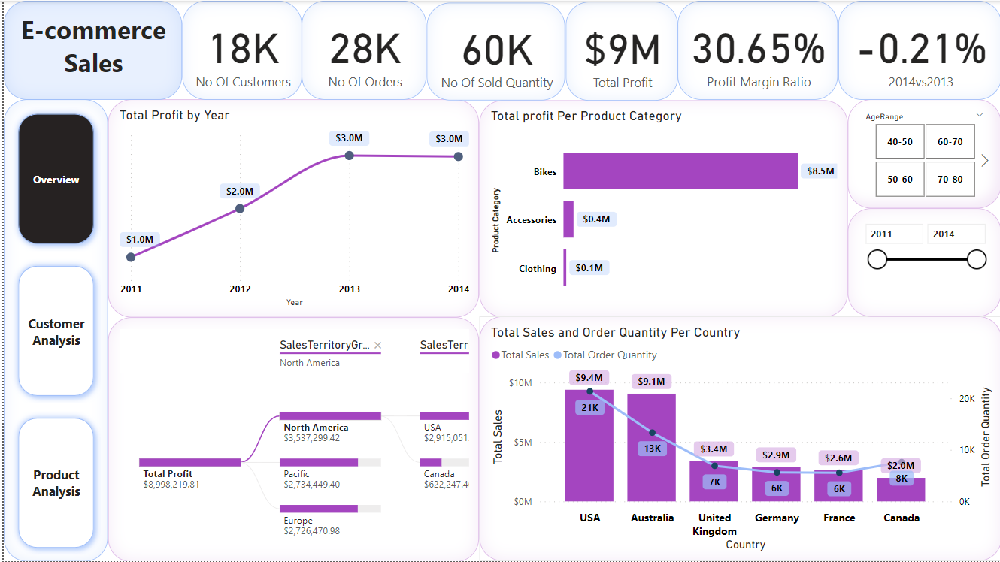
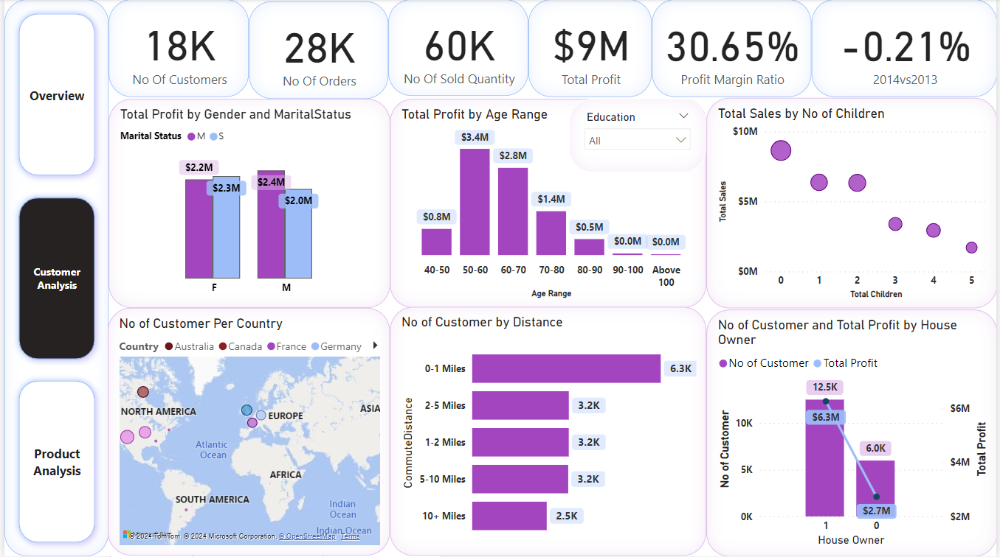
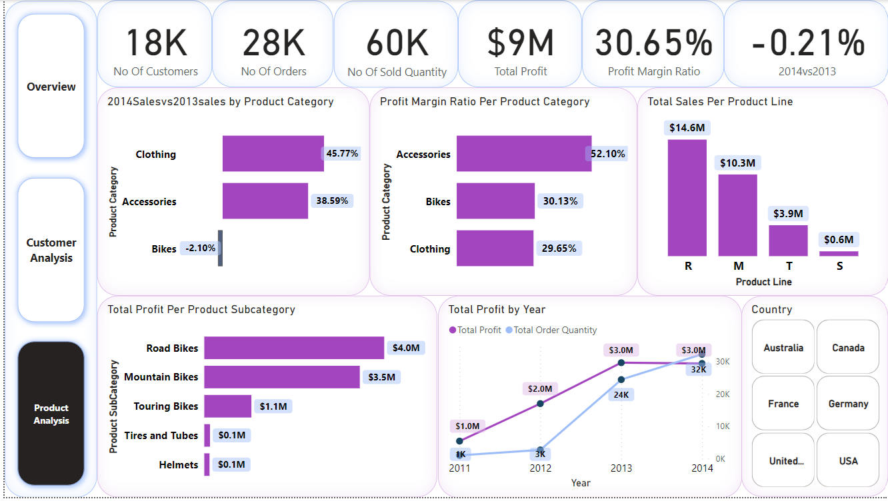

# E-Commerce Sales Report Analysis
## Overview
Welcome to the E-Commerce Sales Dashboard Analysis project! This repository contains a comprehensive report designed for analyzing and visualizing key performance indicators (KPIs) related to e-commerce sales data. The project focuses on providing actionable insights to enhance decision-making processes for businesses operating in the e-commerce sector.

## Features

- **Interactive Dashboard:** Explore an intuitive and user-friendly dashboard that allows users to interact with various visualizations seamlessly.
- **Sales Performance Metrics:** Gain valuable insights into sales performance through charts and graphs depicting revenue trends, top-selling products, and customer acquisition metrics.
- **Customer Behavior Analysis:** Understand customer behavior and preferences with visualizations showcasing customer demographics, purchase patterns, and product affinity.

- **Product Analysis:**
  In the product analysis section, we delve into a detailed examination of our e-commerce platform's product landscape, providing valuable insights into the 
  performance, trends, and characteristics of the items offered. Here are key features and insights:

  1. **Top-Selling Products:**
      - Discover the powerhouse products that consistently lead in sales, contributing significantly to our overall revenue.

  2. **Revenue Contribution:**
      - Gain a clear understanding of the financial impact of each product, with insights into their individual contributions to the total revenue.

  3. **Sales Growth Trends:**
      - Uncover products experiencing noteworthy sales growth or identify those facing declining trends, allowing for strategic inventory and marketing decisions.

